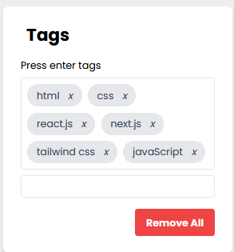

# Tag Input Component (React js)

Tag Input Component is a React component that allows users to add and remove tags.

### Features
 1. Add tags by pressing Enter or separating them with commas.
2. Each tag is displayed as a removable item.
3. Remove individual tags by clicking the 'x' icon.
4. Clear all tags with the "Remove All" button.

### How It Works
The TagInputComponent leverages React's state management to dynamically update and display tags as they are added or removed. It listens for user interactions, allowing smooth tag management in a user-friendly manner.

### Contributing
Contributions are welcome! Feel free to open issues and submit pull requests.

## Installation

1. Clone the repository or copy the code.
2. Make sure you have React installed in your project.
3. Copy the `TagInputComponent` code into your React application.


## Usage

1. Import the `TagInputComponent` into your desired component:

```jsx
import React from 'react';
import TagInputComponent from './TagInputComponent'; // Adjust the path accordingly

function App() {
  return (
    <div>
      {/* Your other components */}
      <TagInputComponent />
      {/* Your other components */}
    </div>
  );
}

export default App;

// TagInputComponents

import React, { useState, useEffect } from 'react';

const TagInputComponent = () => {
  const [tags, setTags] = useState(['Webster', 'CSS']);
  const [inputValue, setInputValue] = useState('');

  useEffect(() => {
    countTags();
    createTag();
  }, [tags]);

  const countTags = () => {
    ulRef.current.focus();
  };

  const createTag = () => {
    countTags();
  };

  const remove = tagToRemove => {
    setTags(prevTags => prevTags.filter(tag => tag !== tagToRemove));
  };

  const addTag = e => {
    if (e.key === 'Enter') {
      const tag = inputValue.trim().replace(/\s+/g, ' ');
      if (tag.length > 0) {
        const tagsToAdd = tag.split(',').map(tagPart => tagPart.trim());
        setTags(prevTags => [...prevTags, ...tagsToAdd]);
      }
      setInputValue('');
    }
  };

  const ulRef = React.createRef();

  return (
    <div className="flex items-center justify-center min-h-screen bg-gray-900">
      <div className="w-80 bg-white rounded-lg p-6 shadow-md">
        <div className="flex items-center">
          
          <h2 className="text-2xl font-semibold ml-2">Tags</h2>
        </div>
        <div className="mt-4">
          <p className="text-sm">Press enter or add a comma after each tag</p>
          <ul className="flex flex-wrap p-1 mt-2 border rounded" ref={ulRef}>
            {tags.map((tag, index) => (
              <li key={index} className="px-3 py-1 m-1 text-gray-700 bg-gray-200 border rounded-full">
                {tag} <i className="ml-2 text-sm cursor-pointer" onClick={() => remove(tag)}>x</i>
              </li>
            ))}
          </ul>
          <input
            type="text"
            spellCheck="false"
            value={inputValue}
            onChange={e => setInputValue(e.target.value)}
            onKeyUp={addTag}
            className="w-full mt-2 border rounded px-2 py-1 focus:outline-none focus:ring focus:border-blue-300"
          />
        </div>
        <div className="flex items-center justify-end mt-4">
          <button
            onClick={() => setTags([])}
            className="px-4 py-2 text-white font-semibold bg-yellow-500 rounded hover:bg-yellow-600 transition duration-300"
          >
            Remove All
          </button>
        </div>
      </div>
    </div>
  );
};

export default TagInputComponent;

```
